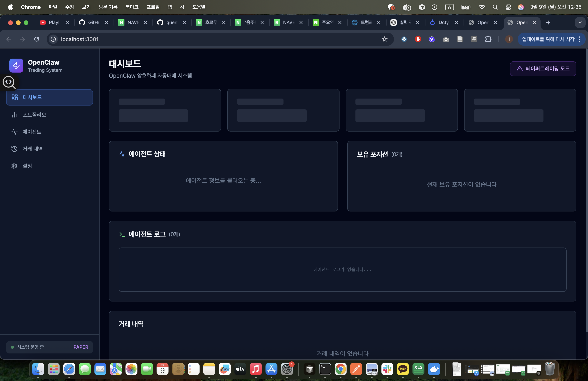
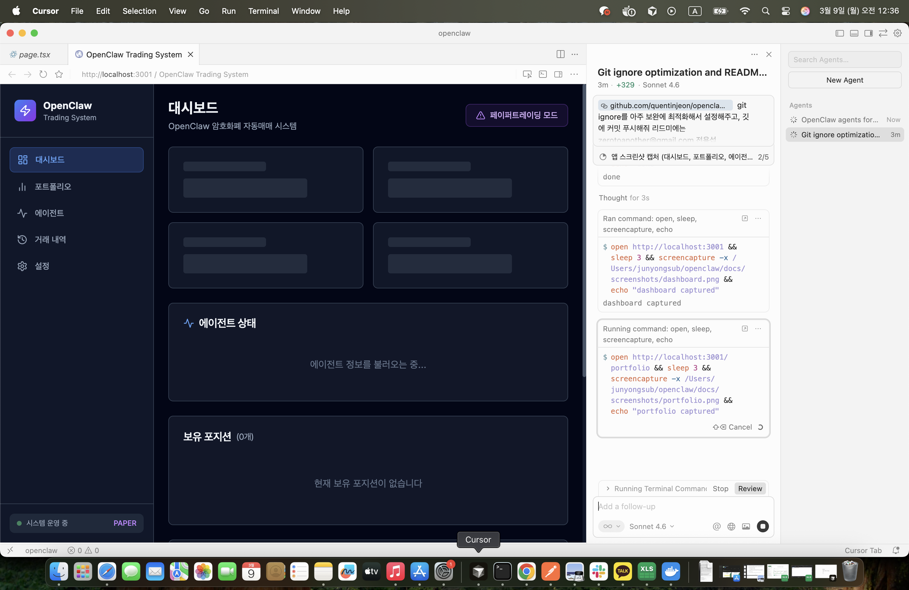
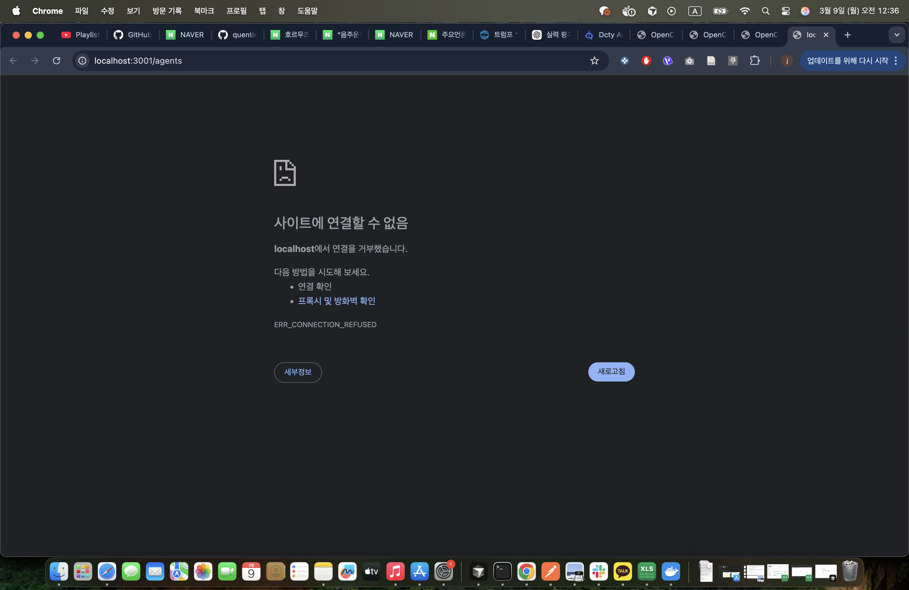
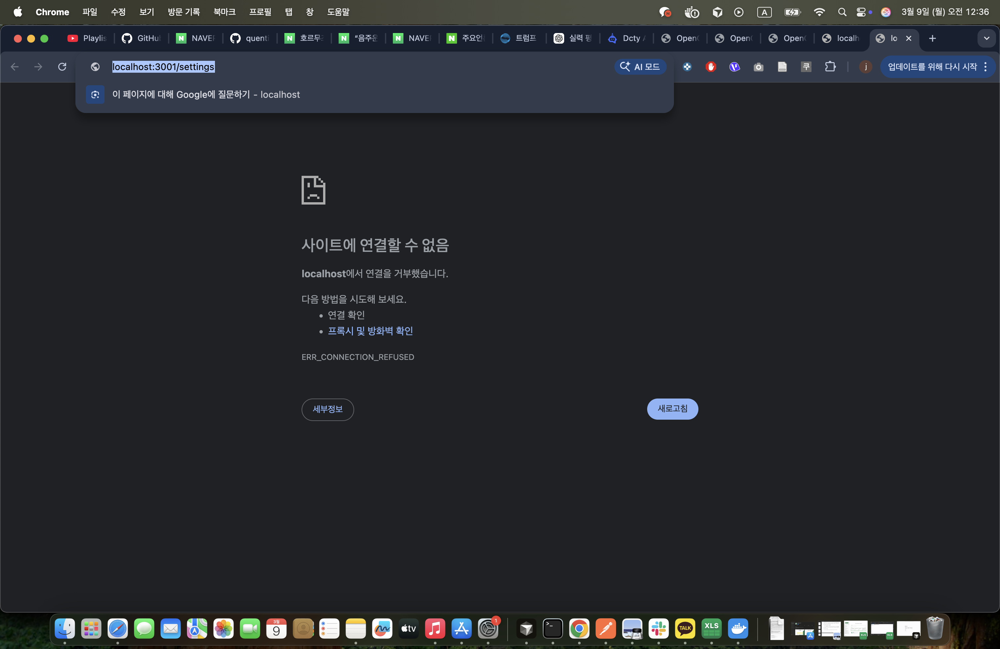

# 🦅 OpenClaw Trading System

> **AI 멀티에이전트 기반 암호화폐 자동매매 시스템**  
> Multi-Agent Cryptocurrency Automated Trading System

[](https://python.org)
[](https://fastapi.tiangolo.com)
[](https://nextjs.org)
[](https://typescriptlang.org)
[](LICENSE)

---

## 📸 스크린샷

### 메인 대시보드


### 포트폴리오 현황


### 에이전트 모니터링


### 설정 화면


---

## 📖 프로젝트 개요

OpenClaw는 **5개의 전문 AI 에이전트**가 파이프라인 방식으로 협력하여 암호화폐를 자율 매매하는 시스템입니다.  
각 에이전트가 독립적인 역할을 수행하며, 실시간 대시보드를 통해 모든 활동을 투명하게 모니터링할 수 있습니다.

```
[MarketAnalyzerAgent]  →  시장 데이터 수집 및 기술적 분석
        ↓ MarketSignal (BULLISH / BEARISH / NEUTRAL)
[StrategyAgent]        →  매매 전략 실행 및 신호 생성
        ↓ TradingSignal (BUY / SELL / HOLD)
[RiskManagerAgent]     →  리스크 평가 및 포지션 크기 결정
        ↓ ApprovedOrder
[ExecutionAgent]       →  거래소 실제 주문 실행
        ↓ TradeResult
[PortfolioAgent]       →  포트폴리오 성과 추적 및 리포트
```

---

## ✨ 주요 기능

| 기능 | 설명 |
|------|------|
| 🤖 **멀티에이전트 시스템** | 5개 전문 에이전트 파이프라인 자동매매 |
| 📊 **실시간 대시보드** | WebSocket 기반 포트폴리오·에이전트 실시간 모니터링 |
| 🛡️ **리스크 관리** | 최대 포지션 크기, 일일 손실 한도, 연속 손실 제한 |
| 📈 **다중 전략** | RSI 역추세, MACD 크로스오버, 볼린저 밴드 돌파 |
| 🏦 **다중 거래소** | Binance, Upbit, Bybit, OKX 지원 (ccxt) |
| 🧪 **페이퍼트레이딩** | 실거래 없이 전략 검증 (모의거래 모드) |

---

## 🛠️ 기술 스택

### 백엔드
- **FastAPI** 0.110+ - 고성능 REST API + WebSocket
- **Python** 3.11+ - 메인 언어
- **ccxt** 4.x - 거래소 통합 연동
- **SQLite / PostgreSQL** - 데이터 영속성
- **APScheduler** - 에이전트 스케줄링
- **pandas, numpy** - 데이터 분석

### 프론트엔드
- **Next.js** 14 (App Router) - 메인 프레임워크
- **TypeScript** - 타입 안전성
- **Tailwind CSS** - 다크 테마 UI
- **Zustand** - 전역 상태 관리
- **SWR** - 서버 상태 캐싱
- **Recharts** - 차트 시각화

### 인프라
- **Docker + Docker Compose** - 컨테이너화

---

## 🚀 빠른 시작

### 사전 요구사항
- Python 3.11+
- Node.js 18+
- Docker (선택)

### 1. 저장소 클론
```bash
git clone https://github.com/quentinjeon/openclaw-trade.git
cd openclaw-trade
```

### 2. 환경변수 설정
```bash
cp env.example .env
# .env 파일을 열어 실제 값 입력
```

### 3. 백엔드 실행
```bash
cd backend
python -m venv venv
source venv/bin/activate  # Windows: venv\Scripts\activate
pip install -r requirements.txt
uvicorn main:app --host 0.0.0.0 --port 8000 --reload
```

### 4. 프론트엔드 실행
```bash
cd frontend
npm install
npm run dev
```

### 5. Docker Compose로 한번에 실행
```bash
docker-compose up -d
```

- **프론트엔드**: http://localhost:3000
- **백엔드 API**: http://localhost:8000
- **API 문서**: http://localhost:8000/docs

---

## 🤖 에이전트 구조

### MarketAnalyzerAgent
- **역할**: 시장 데이터 수집 및 기술적 분석
- **실행 주기**: 1분마다
- **분석 지표**: RSI, MACD, 볼린저 밴드, MA 20/50/200, 거래량

### StrategyAgent
- **역할**: 매매 전략 실행 및 신호 생성
- **지원 전략**: RSI 역추세, MACD 크로스오버, 볼린저 밴드 돌파, 복합 전략

### RiskManagerAgent
- **역할**: 리스크 평가 및 포지션 크기 결정
- **체크 항목**: 최대 포지션 크기, 동시 포지션 수, 일일 손실 한도, 연속 손실 횟수

### ExecutionAgent
- **역할**: 거래소에 실제 주문 실행
- **기능**: 시장가/지정가 주문, 손절/익절 자동 설정, 페이퍼트레이딩

### PortfolioAgent
- **역할**: 포트폴리오 성과 추적 및 리포트
- **추적 지표**: 총 자산 (USD), 포지션 목록, 일일/총 PnL, 승률

---

## 📁 프로젝트 구조

```
openclaw/
├── backend/
│   ├── agents/              # 5개 에이전트 구현
│   │   ├── market_analyzer.py
│   │   ├── strategy_agent.py
│   │   ├── risk_manager.py
│   │   ├── execution_agent.py
│   │   └── portfolio_agent.py
│   ├── core/                # 설정, DB, WebSocket
│   ├── exchange/            # 거래소 커넥터 (ccxt)
│   ├── models/              # SQLAlchemy 모델
│   ├── routers/             # FastAPI 라우터
│   ├── schemas/             # Pydantic 스키마
│   ├── strategies/          # 매매 전략
│   └── main.py              # 앱 진입점
├── frontend/
│   └── src/
│       ├── app/             # Next.js 페이지
│       ├── components/      # UI 컴포넌트
│       ├── hooks/           # 커스텀 훅
│       ├── services/        # API 클라이언트
│       ├── stores/          # Zustand 스토어
│       └── types/           # TypeScript 타입
├── docs/
│   ├── prd/                 # PRD 문서
│   └── screenshots/         # 앱 스크린샷
├── docker-compose.yml
├── env.example              # 환경변수 예제
└── .gitignore
```

---

## 🔒 보안 주의사항

> ⚠️ **중요**: 이 시스템은 실제 자금을 자동으로 거래합니다.

- **반드시 페이퍼트레이딩으로 충분히 테스트 후 실거래 적용**
- API 키는 반드시 `.env` 파일에 보관 (git 커밋 금지)
- 리스크 파라미터를 보수적으로 시작 (최대 포지션 5% 권장)
- 암호화폐 투자는 원금 손실 위험이 있습니다

---

## 📡 API 엔드포인트

| Method | Path | 설명 |
|--------|------|------|
| GET | `/api/portfolio/` | 현재 포트폴리오 조회 |
| GET | `/api/trades/` | 거래 내역 조회 |
| POST | `/api/trades/close-all` | 전체 포지션 청산 |
| GET | `/api/agents/` | 에이전트 상태 조회 |
| POST | `/api/agents/{type}/start` | 에이전트 시작 |
| POST | `/api/agents/{type}/stop` | 에이전트 중지 |
| GET | `/api/settings/` | 전체 설정 조회 |
| PUT | `/api/settings/risk` | 리스크 설정 변경 |

### WebSocket 채널
| 채널 | 설명 |
|------|------|
| `/ws/portfolio` | 실시간 포트폴리오 업데이트 |
| `/ws/agents` | 실시간 에이전트 로그 스트림 |
| `/ws/trades` | 실시간 거래 체결 알림 |

---

## 🗺️ 개발 로드맵

- [x] **Phase 1 (MVP)**: 5개 에이전트 시스템 + 기본 대시보드
- [ ] **Phase 2**: 다중 거래소 지원 + ML 기반 전략 + 백테스트
- [ ] **Phase 3**: 전략 자동 최적화 + 멀티 심볼 동시 거래 + 알림 시스템

---

## 👨‍💻 개발자

| | |
|--|--|
| **이름** | 전용섭 (Yongsub Jeon) |
| **GitHub** | [@yongsub.jeon](https://github.com/quentinjeon) |
| **이메일** | [zerotoanother@gmail.com](mailto:zerotoanother@gmail.com) |

---

## 📄 라이센스

MIT License © 2026 전용섭 (Yongsub Jeon)

---

*최종 업데이트: 2026-03-09*  
*버전: 1.0.0*
